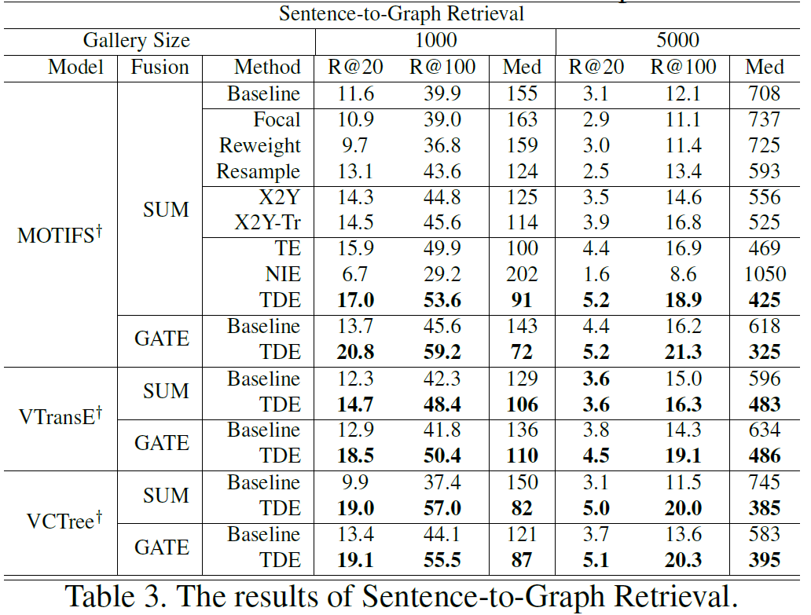

# Sentence-to-Graph Retrieval (S2G)

Warning -  this part of code is less organized.

## Preprocessing

Pre-requisite:  ```vg_data, vg_dict, vg_info``` should have already downloaded if you followed DATASET.md.

You will also need a pre-trained SGDet model, for example from [here](https://onedrive.live.com/embed?cid=22376FFAD72C4B64&resid=22376FFAD72C4B64%21781947&authkey=AF_EM-rkbMyT3gs). This is the SGDet model that is beeing described in the main `README.md`

Download the ground-truth captions and generated sentence graphs from [here](https://onedrive.live.com/embed?cid=22376FFAD72C4B64&resid=22376FFAD72C4B64%21779999&authkey=AGW0Wxjb1JSDFnc).

Please note that this file needs to be configured properly in maskrcnn_benchmark/config/paths_catalog.py, See `DATASETS`, `VG_stanford_filtered_with_attribute` under the key `capgraphs_file`.

We used [SceneGraphParser](https://github.com/vacancy/SceneGraphParser) to generate these sentence graphs.
The script ```maskrcnn_benchmark/image_retrieval/sentence_to_graph_processing.py``` partially shows, how the text scene graphs were generated (under the key `vg_coco_id_to_capgraphs` in the dowloaded generated sentence graphs file).


Create the test results of the SGDet model for the training and test datasets with:

```bash
CUDA_VISIBLE_DEVICES=0 python -m torch.distributed.launch --master_port 10027 --nproc_per_node=1 tools/relation_test_net.py --config-file "configs/e2e_relation_X_101_32_8_FPN_1x.yaml" MODEL.ROI_RELATION_HEAD.USE_GT_BOX False MODEL.ROI_RELATION_HEAD.USE_GT_OBJECT_LABEL False MODEL.ROI_RELATION_HEAD.PREDICTOR CausalAnalysisPredictor MODEL.ROI_RELATION_HEAD.CAUSAL.EFFECT_TYPE TDE MODEL.ROI_RELATION_HEAD.CAUSAL.FUSION_TYPE sum MODEL.ROI_RELATION_HEAD.CAUSAL.CONTEXT_LAYER motifs TEST.IMS_PER_BATCH 1 DTYPE "float16" GLOVE_DIR /home/kaihua/glove MODEL.PRETRAINED_DETECTOR_CKPT /home/kaihua/checkpoints/causal-motifs-sgdet OUTPUT_DIR /home/kaihua/checkpoints/causal-motifs-sgdet DATASETS.TO_TEST train
```

```bash
CUDA_VISIBLE_DEVICES=0 python -m torch.distributed.launch --master_port 10027 --nproc_per_node=1 tools/relation_test_net.py --config-file "configs/e2e_relation_X_101_32_8_FPN_1x.yaml" MODEL.ROI_RELATION_HEAD.USE_GT_BOX False MODEL.ROI_RELATION_HEAD.USE_GT_OBJECT_LABEL False MODEL.ROI_RELATION_HEAD.PREDICTOR CausalAnalysisPredictor MODEL.ROI_RELATION_HEAD.CAUSAL.EFFECT_TYPE TDE MODEL.ROI_RELATION_HEAD.CAUSAL.FUSION_TYPE sum MODEL.ROI_RELATION_HEAD.CAUSAL.CONTEXT_LAYER motifs TEST.IMS_PER_BATCH 1 DTYPE "float16" GLOVE_DIR /home/kaihua/glove MODEL.PRETRAINED_DETECTOR_CKPT /home/kaihua/checkpoints/causal-motifs-sgdet OUTPUT_DIR /home/kaihua/checkpoints/causal-motifs-sgdet DATASETS.TO_TEST test
```

It will create under `/home/kaihua/checkpoints/causal-motifs-sgdet/inference/` the directories `VG_stanford_filtered_with_attribute_train` and `VG_stanford_filtered_with_attribute_test` with saved results.

Now, run the ```maskrcnn_benchmark/image_retrieval/preprocessing.py --test-results-path your-result-path --output-file-name outfile.json``` for both training and testing results previously produced.

You should be obtaining two files:

`/home/kaihua/checkpoints/causal-motifs-sgdet/inference/VG_stanford_filtered_with_attribute_train/sg_of_causal_sgdet_ctx_only.json`

and 

`/home/kaihua/checkpoints/causal-motifs-sgdet/inference/VG_stanford_filtered_with_attribute_test/sg_of_causal_sgdet_ctx_only.json`

## Training and Evaluation

You need to manually set ```sg_train_path```, ```sg_val_path``` and ```sg_test_path``` in ```tools/image_retrieval_main.py``` to `/home/kaihua/checkpoints/causal-motifs-sgdet/inference/VG_stanford_filtered_with_attribute_train/sg_of_causal_sgdet_ctx_only.json`
, `/home/kaihua/checkpoints/causal-motifs-sgdet/inference/VG_stanford_filtered_with_attribute_val/sg_of_causal_sgdet_ctx_only.json`
and 

`/home/kaihua/checkpoints/causal-motifs-sgdet/inference/VG_stanford_filtered_with_attribute_test/sg_of_causal_sgdet_ctx_only.json` respectively.


If you use your own pretrained model: keep in mind that you need to evaluate your model on ** training, validation and testing set ** to get the generated crude scene graphs. Our evaluation code will automatically saves the crude SGGs into ```checkpoints/MODEL_NAME/inference/VG_stanford_filtered_with_attribute_test/```  or ```checkpoints/MODEL_NAME/inference/VG_stanford_filtered_with_attribute_train/```
or ```checkpoints/MODEL_NAME/inference/VG_stanford_filtered_with_attribute_val/```


Run the ```tools/image_retrieval_main.py``` for both training and evaluation. 

For example, you can train it with:

```tools/image_retrieval_main.py --config-file "configs/e2e_relation_X_101_32_8_FPN_1x.yaml" SOLVER.IMS_PER_BATCH 32 SOLVER.PRE_VAL True SOLVER.SCHEDULE.TYPE WarmupMultiStepLR SOLVER.MAX_ITER 18 SOLVER.CHECKPOINT_PERIOD 3 OUTPUT_DIR /media/rafi/Samsung_T5/_DATASETS/vg/model/ SOLVER.VAL_PERIOD 3```

You call also run an evaluation on any set (parameter `DATASETS.TO_TEST`) with:

```tools/image_retrieval_test.py --config-file "configs/e2e_relation_X_101_32_8_FPN_1x.yaml" SOLVER.IMS_PER_BATCH 32 MODEL.PRETRAINED_DETECTOR_CKPT /media/rafi/Samsung_T5/_DATASETS/vg/model/[your_model_name].pytorch OUTPUT_DIR /media/rafi/Samsung_T5/_DATASETS/vg/model/results DATASETS.TO_TEST test```

Please note that the calculation logic differs from the one used in ```tools/image_retrieval_main.py```.
Details of the calculation can be found under ```Test Cases Metrics.pdf```, under the Type Fei Fei.


## Results

Sentence-to-Graph Retrieval (S2G) results are given in the paper [Unbiased Scene Graph Generation from Biased Training](https://arxiv.org/abs/2002.11949):



## Acknowledgement

Since I lost part of the code when I merged several jupyter notes into the preprocessing.py files, the "image_graph" and "text_graph" are missing in the original txt_img_sg dictionary. Thanks to the [Haeyong Kang](https://scholar.google.com/citations?user=v_tUj4oAAAAJ&hl=ko) from KAIST, he filled in the missing part of preprocessing.py.
